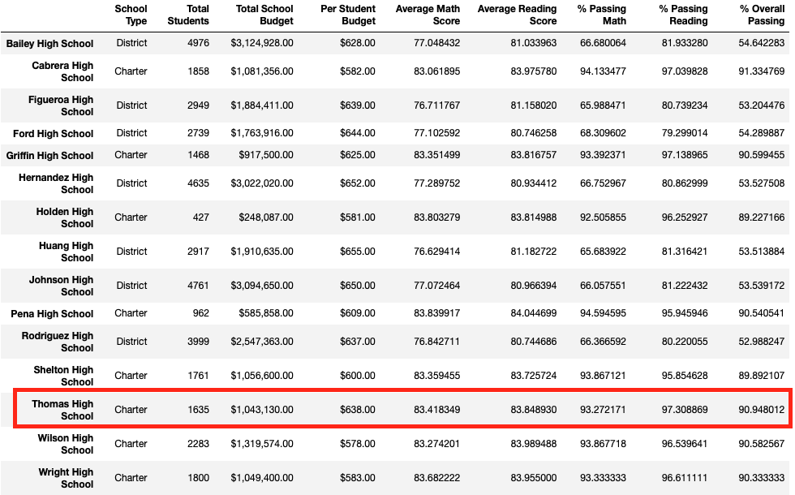
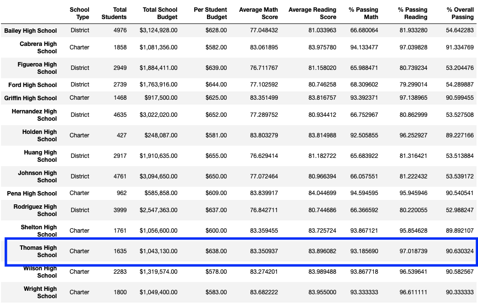
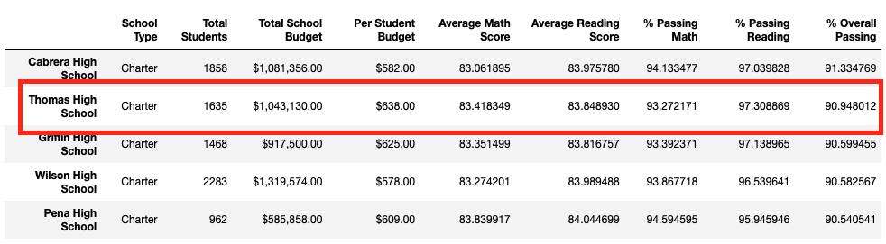
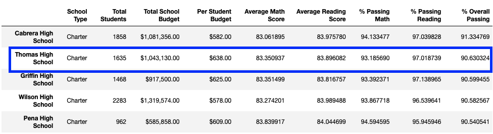
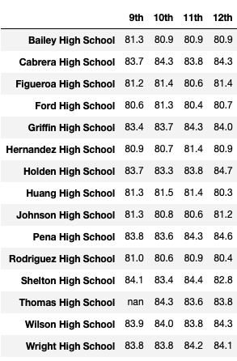
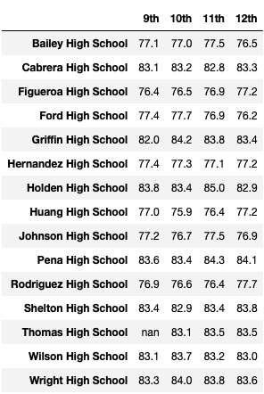
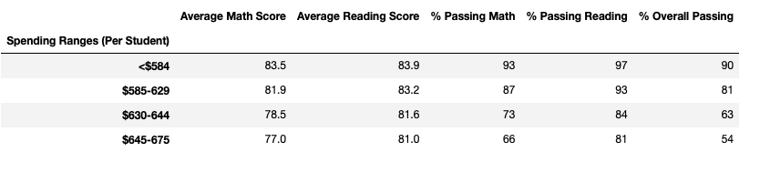
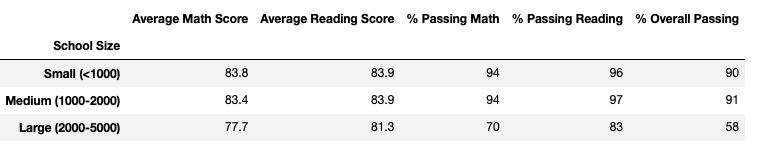
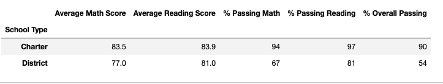

# School_District_Analysis

## Overview of the school district analysis
The purpose of the analysis is to get a high-level snapshot of the school district's key metrics and an overview of those key metrics for each school. The analysis will provide the average math and reading scores received by students in each grade level at each school, school performance based on the budget per student, school performance based on school size, and school performance based on the type of school. Finally, the top 5 and bottom 5 performing schools, based on the overall passing rate will also be included.

## Results
The district summary was not affected after removing the 9th graders from Thomas High School. However, the school summary was affected after removing the 9th graders from Thomas High School. Particularly it changed Thomas High School's Average Math Score, Average Reading Score, % Passing Math, % Passing Reading, %Overall Passing. The Average Math Score went down from 83.4 to 83.3 (- 0.1), the Average Reading Score went up from 83.8 to 83.9 (+ 0.1), the % Passing Math went down from 93.2 to 93.1 (- 0.1), the % Passing Reading went down from 97.3 to 97.0 (- 0.3), and the % Overall Passing went down from 90.9 to 90.6 (- 0.3). Other rows were not affected by removing the 9th graders from Thomas High School. Below is the table showing the District Summary with and without the 9th graders from Thomas High School

### District Summary with 9th graders from Thomas High School

### District Summary without 9th graders from Thomas High School

Replacing the 9th grader's math and reading scores did not affect Thomas High School's performance relative to other schools. Below are tables showing that despite the changes to Average Math Score, Average Reading Score, % Passing Math, % Passing Reading, and %Overall Passing there was no shift. The change did not remove Thomas High School from the 2nd place as the top-performing schools.

### Top Performing Schools with 9th graders from Thomas High School

### Top Performing Schools without 9th graders from Thomas High School

There are no major effects when replacing the 9th graders from Thomas High School scores because the change only affected 9th graders from Thomas High School. Below are tables showing how the Math score went from 83.6 to nan and the Reading score went from 83.7 to nan. The other schools were not affected and the other grades within Thomas High School were not affected either.

### Math & Reading Scores by grade(with 9th grader from Thomas High School)
#### Math (with 9th graders from Thomas High School)

#### Reading (with 9th graders from Thomas High School)

### Math & Reading Scores by grade(without 9th grader from Thomas High School)
#### Math (without 9th graders from Thomas High School)

#### Reading (without 9th graders from Thomas High School)

Furthermore, there was no change to the Scores by school spending, Scores by school size, and Scores by school type. There was no change because the below tables leverage the data from the school summary and that data had minor changes. The biggest difference before and after removing the 9th graders from Thomas High School is minus 0.3. In a large dataset such as this one, 0.3 is not going to be easily visible in a high-level analysis.

### Scores by school spending

### Scores by school size

### Scores by school type

  
## Summary
The four major changes to the school district analysis are changes to the % Overall Passing, % Passing Reading, % Passing Math, and Average Math Score. The % Overall Passing and % Passing Reading values went down by 0.3. The % Passing Math and Average Math Score values went down by 0.1. Besides these four major changes, the overall school district analysis after reading and math scores for the 9th grade at Thomas High School have been replaced with NaNs remained the same. Thomas High School remained in 2nd place as the top-performing school when sorting by % Overall Passing. Also, the tables Score by school spending, Scores by school size, and Scores by school type remained the same after replacing 9th grade at Thomas High School reading and math scores with NaNs.
