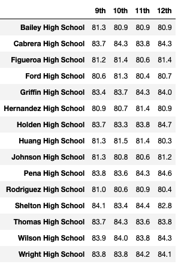

# School_District_Analysis

## Overview of the school district analysis
The purpose of the analysis is to get a high-level snapshot of the school distrit's key metrics and overview of those key metrics for each school. The analysis will provide the average math and reading scores received by student in each grade level at each school, school performance based on the budget per student, school performace based on school size, and school performance based on the type of school. Finaly, the top 5 and bottom 5 performing schools, based on the overall passing rate will also be included.

## Results
The district summary was not affected after removing the 9th graders from Thomas High School. However, the school summary was affected after removing the 9th graders from Thomas High School. Particularly it changed Thomas High School's Average Math Score, Average Reading Score, % Passing Math, % Passing Reading, %Overall Passing. The Average Math Score went down from 83.4 to 83.3 (- 0.1), the Average Reading Score went up from 83.8 to 83.9 (+ 0.1), the % Passing Math went down from 93.2 to 93.1 (- 0.1), the % Passing Reading went down from 97.3 to 97.0 (- 0.3), and the % Overall Passing went down from 90.9 to 90.6 (- 0.3). Other rows were not affected by removing the 9th graders from Thomas High School. Below is the table showing the District Summary with and without the 9th grader from Thomas High School

### District Summary with 9th graders from Thomas High School

### District Summary without 9th graders from Thomas High School

- How does replacing the ninth graders’ math and reading scores affect Thomas High School’s performance relative to the other schools?

- How does replacing the ninth-grade scores affect the following:
  - Math and reading scores by grade
  
    
    
    
    
    
  - Scores by school spending
    
    
  - Scores by school size
    
    
  - Scores by school type
    
  
## Summary
